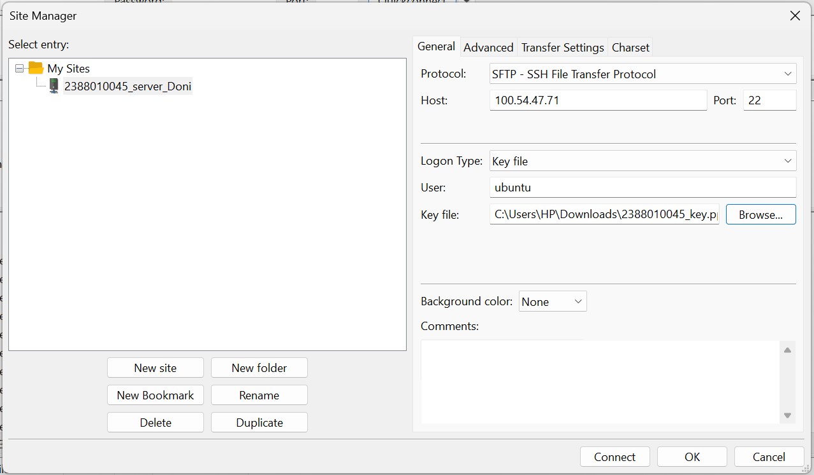
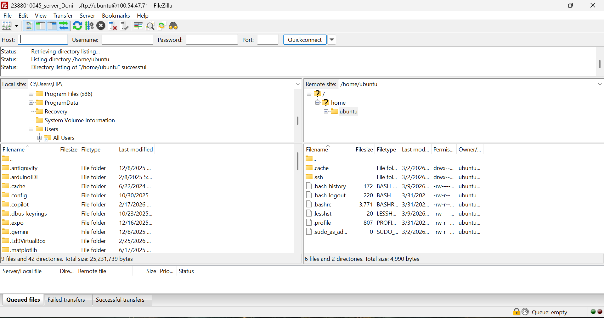
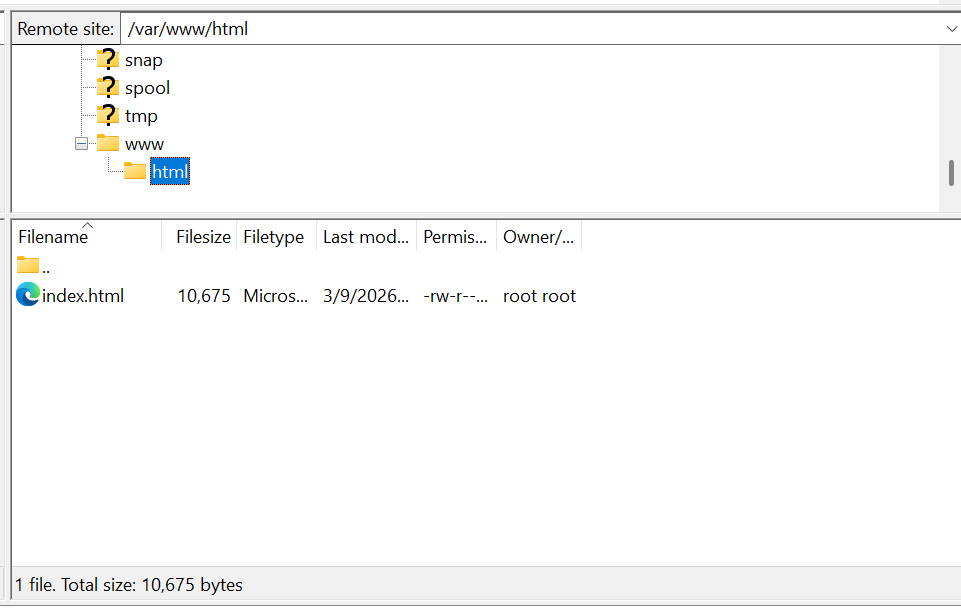
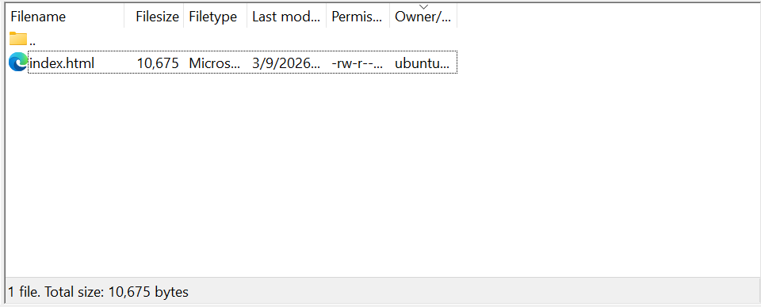
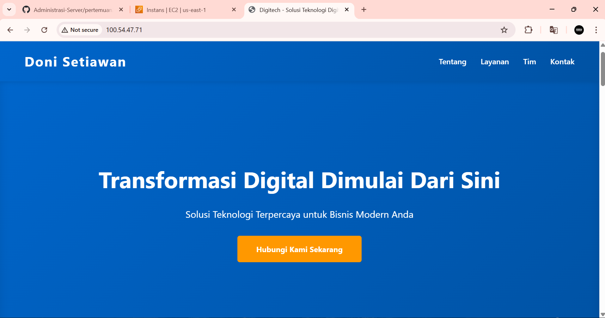

# Migrasi File local ke Cloud Server AWS EC2

1. Memilih Tools Migrasi File, misal kita akan gunakan filezilla
- unduh dan insatall di https://filezilla-project.org/download.php?type=client
- buka filezilla client
- aktifkan instance di AWS 
- keembali ke filezilla
- klik file > site manager
- klik new site
- protocol SFTP
- host diisi ip public ec2
- port diisi 22
- login type > key file
- user > ubuntu
- key file > pilih file .ppk/ .pem
- klik ok
- ctrl s
- klik connect

2. Pada dashboard utama filezilla akan terbagi menjadi 2 panel

- panle kiri > File local (Komputer Sendiri)
- panel kanan > File server (AWS EC2)

3. Arahkan directory cloud (Panle kanan) ke folder web services area

-/var/www/html

4. untuk solusi permission denied pad folder /var/www/html

- Ubah kepemilikan Folder
- Mengubah folder /var/www/html aggar bisa diakses oleh user 'ubuntu'
- Sintaks: sudo chown -R ubuntu:ubuntu /var/www/html
- enter lalu ke filezilla refresh 

5. Edit file index.html menjadi company profile
- klik kanan pada file index.html
- klik edit
- edit file index.html menjadi company profile
 