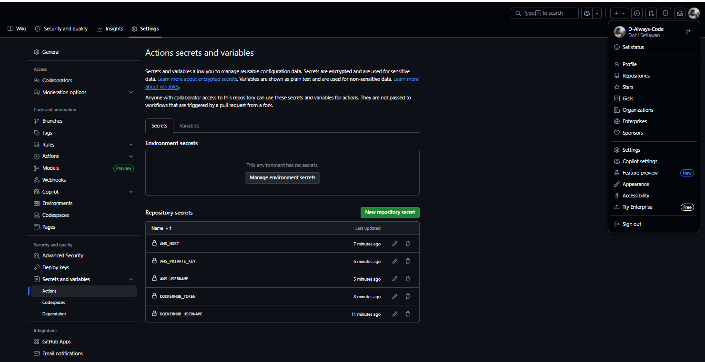

Modernisasi Ci/CD

1. Mengisi Secrets Variable di Github Actions
    - Buka repo di Github
    - Klik settings ->  Secrets and Variables -> Actions
    - Isi Nama = DOCKERHUB_USERNAME dan Value = usernamae akun dockerhub
    - Klik new repository Secret
    - Isi nama = DOCKERHUB_TOKEN dan value = token akun dockerhub
    - klik new repository secret
    - isi nama = AWS_HOST dan value = IP address dari innstance
    - klik new repository
    - isi nama AWS_USERNAME dan Value = ubuntu
    - klik new repository 
    - Isi nama AWS_PRIVATE_KEY dan Value = file.pem (berisi tanda awal dan akhir juga)
    

2. Melakukan Edit File Pipeline di Github
    - Buka project Compro_nim
    - Bat Folder Baru .github -> Buat Folder workflow -> Buat File deploy.yaml
    - isi file deploy.yaml sebagai berikut :
    name: Deploy Next.js to AWS EC2
        on:
        push:
            branches: [ main ]
        jobs:
        build-and-deploy:
            runs-on: ubuntu-latest
            steps:
            - name: Checkout code
              uses: actions/checkout@v4

            - name: Login to Docker Hub
              uses: docker/login-action@v3
              with:
                username: ${{ secrets.DOCKERHUB_USERNAME }}
                password: ${{ secrets.DOCKERHUB_TOKEN }}

            - name: Build and push Docker image
              uses: docker/build-push-action@v5
              with:
                context: .
                push: true
                tags: ${{ secrets.DOCKERHUB_USERNAME }}/compro_nim:latest

            - name: Deploy to EC2 via SSH and run docker compose 
              uses: appleboy/ssh-action@v1.0.3
              with:
                host: ${{ secrets.AWS_HOST }}
                username: ${{ secrets.AWS_USERNAME }}
                key: ${{ secrets.AWS_PRIVATE_KEY }}
                port: 22
                script: |
                docker rm -f compro_nim
                docker pull ${{ secrets.DOCKERHUB_USERNAME }}/compro_nim:latest
                docker run -d --name compro_nim -p 80:80 ${{ secrets.DOCKERHUB_USERNAME }}/compro_nim:latest

3. Sebelum melakukan Commit dan Synch pada File
    - Pastikan sudah disable apache2 -> sudo systemctl disable apache2
    - pastikan sudah stop apache2 -> sudo systemctl stop apache2
    - Pastikan user ubuntu sudah ditambahkan ke docker -> sudo usermod -aG docker ubuntu
    - Baru lakukan Commit dan Push ke Github 

4. update tag title -> Nama-NIM 
