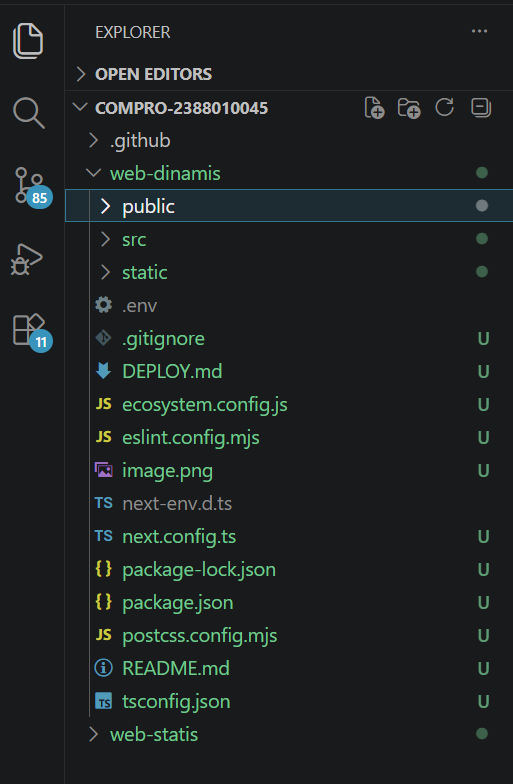
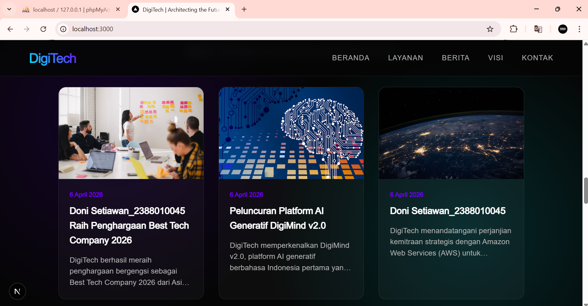

# Deploy Multi Apps CI/CD Docker

1. Start Instance di AWS EC2
2. Patching OS -> sudo apt Update && Sudo apt Upgrade
3. Hapus layanan nginx dan uninstall -> sudo sytemctl stop nginx && sudo systemctl disable nginx 
    - sudo apt remove nginx nginx-common nginx-core
    - sudo apt remove apache2
4. Hapus layanan Mariadb dan uninstall -> sudo sytemctl stop mariadb && sudo systemctl disable mariadb
    - sudo apt auto-remove mariadb-server mariadb-client mariadb-common
5. Testing Next.js + db di local environtment
    - Copy project  digitech pada ptm6 kecuali folder (.next, node_modules, sql) kedalam folder web-dinamis
    
    - Create user baru bukan root di DBMS (Laragon, Xampp, etc)
    