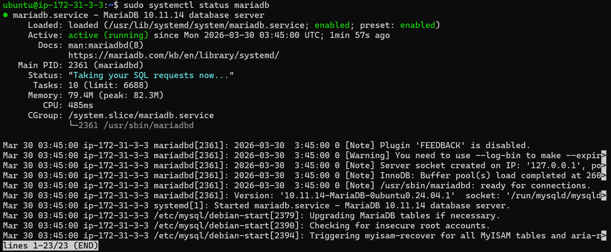
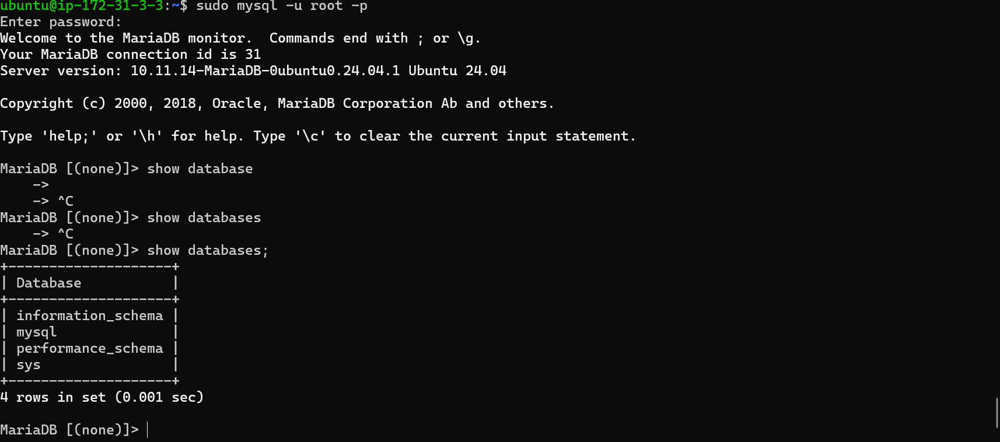
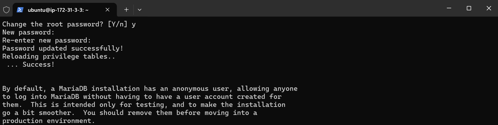
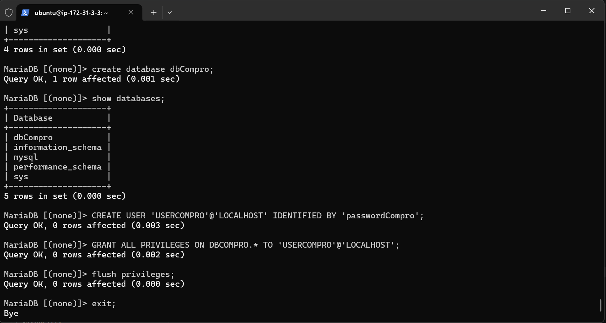
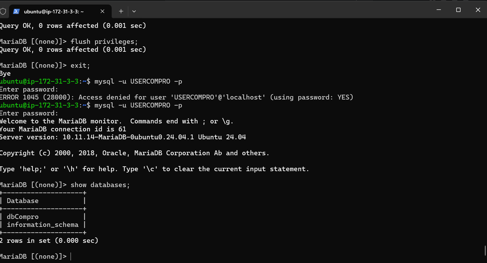

# Membuat database MySQL di AWS EC2

1. Aktifkan instance / VM di EC2
2. Remote SSH Via Terminal
    - masuk ke folder penyimpanan private key AWS
    - masukan Command (ssh -i namafile.pem ubuntu@[IP_ADRESS])
    - Tekan Enter
    - keterangan open ssh hanya support di windows 11
    - untuk windows 10 gunakan putty
3. Lakukan Patching OS
    - sudo apt-get update && sudo apt-get upgrade
4. kita akan install MariaDB
    - sudo apt-get install mariadb-server
    - sudo systemctl status mariadb 
    - coba apakah default setting yang berlaku (sudo mysql - u root -p)
    - cek apakah masih ada databases dummy (show databases;)
    
    
5. kita lakukan hardening security
    - Masukan Command (sudo mysql_secure_installation)
    - masukan password kuat untuk akun root 
    - remove anonymous users (y)
    - disallow root logi remotely (y)
    - remove test database and access to it (y)
    - reload privilege tables now (y)
    
6. Membuat daabase dan User
    - Membuat database untuk Web Company Profile (create database dbCompro;)
    - Membuat User untuk Web Company Profile (create user 'UserCompro'@'localhost'identified by 'passwordCompro';)
    - Memberikan hak akses User untuk web Company Profle (grant all privileges on dbCompro.* to 'userCompro'@'localhost';)
    - Flush Privilege (flush privileges;)
    - keluar dari MySQL (exit;)
    
7. Login Sebagai user baru 
    - Masukan Command (mysql -u userCompro -p)
    - masukan password
    - Cek apakah database dbCompro sudah ada (show databases;)
    