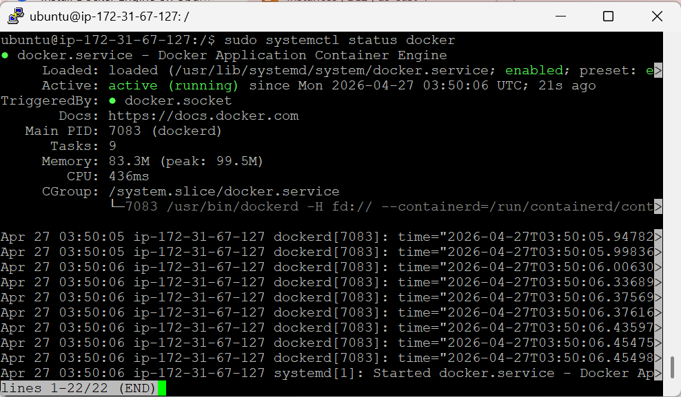
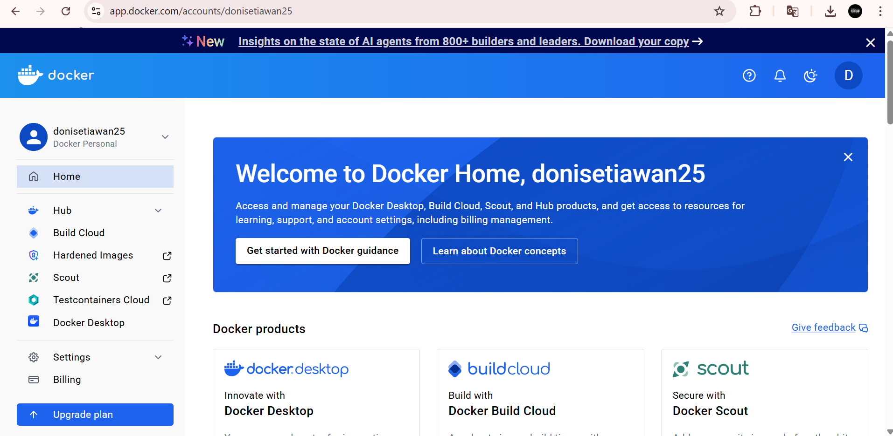
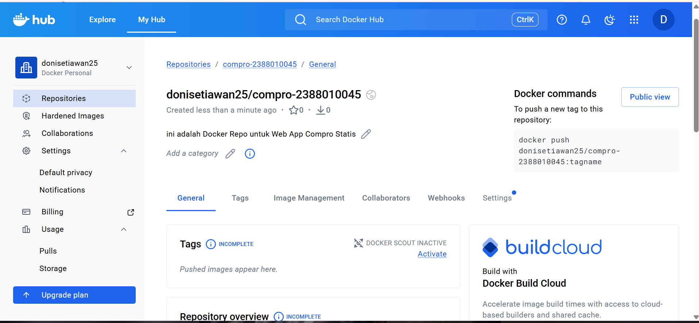
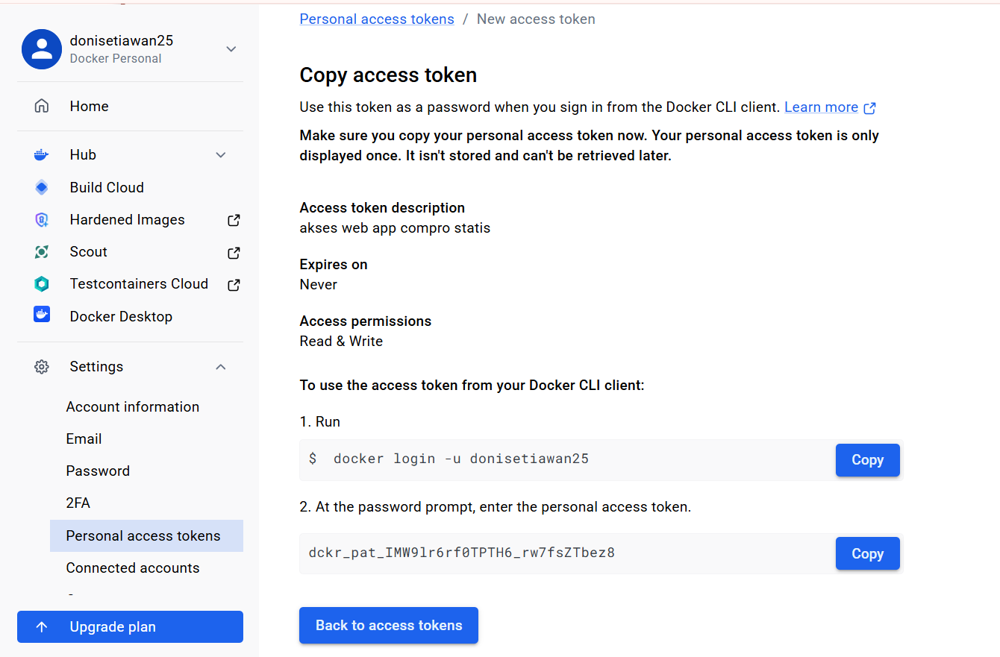
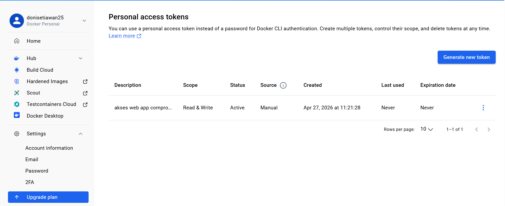
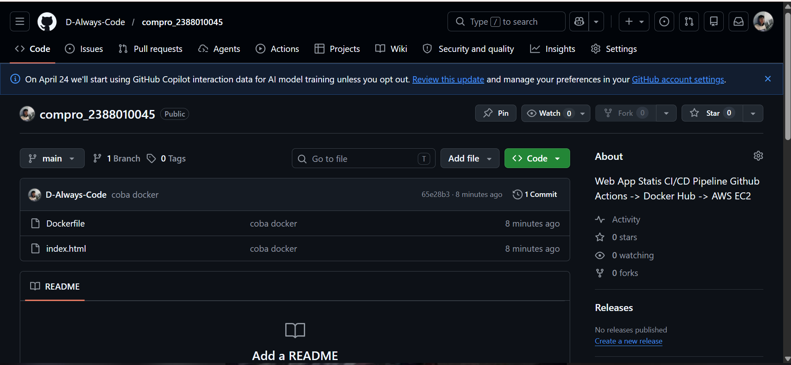

# Intro Docker engine in Instance EC2 AWS

1. Install based Docker Documentation 
    - Uninstall Old version, sebelum dapat menginstal Docker Engine, perlu menghapus instalasi paket-paket yang bertentangan. =>
        sudo apt remove $(dpkg --get-selections docker.io docker-compose docker-compose-v2 docker-doc podman-docker containerd runc | cut -f1)

    - Install docker
        A. Patching OS => sudo apt-get update && sudo apt-get upgrade
        B. add cert Repository for Docker => 
            sudo apt install ca-certificates curl
            sudo install -m 0755 -d /etc/apt/keyrings
            sudo curl -fsSL https://download.docker.com/linux/ubuntu/gpg -o /etc/apt/keyrings/docker.asc
            sudo chmod a+r /etc/apt/keyrings/docker.asc
        C. Add Docker Repository to APT =>
            sudo tee /etc/apt/sources.list.d/docker.sources <<EOF
            Types: deb
            URIs: https://download.docker.com/linux/ubuntu
            Suites: $(. /etc/os-release && echo "${UBUNTU_CODENAME:-$VERSION_CODENAME}")
            Components: stable
            Architectures: $(dpkg --print-architecture)
            Signed-By: /etc/apt/keyrings/docker.asc
            EOF
        D. Update OS => sudo apt-get update
        E. Install Docker Engine => sudo apt install docker-ce docker-ce-cli containerd.io docker-buildx-plugin docker-compose-plugin
        F. cek installation step => sudo systemctl status docker 
         

2. Registrasi DockerHub
    - URL DockerHub => https://hub.docker.com/
    - Sign up dengan github
    

3. Create repo for Docker
    - clik Menu -> Hub -> Repositories
    - klik Button create repositories
    - Isi nama repo = compro-nim dan deskripsi = Web App statis compro
    - visibilty = public
    - klik create 
    

4. Create token acces 
    - klik profile -> account setting -> sidebar personal acces token
    - klik generate new token
    - isi deskripsi
    - expire date = None
    - acces informations = Read & Write
    - Klik generate
     
    

5. Create projek di local
    - Buat folder compro_nim
    - Masukan File index.html comrpo
    - buat file Dockerfile dengan isi sebagai berikut
        FROM nginx:alpine
        COPY index.html /usr/share/nginx/html/index.html
        EXPOSE 80

6. push projek ke github 
    - Buat repo di github = compro_nim
    - Push projek di github 
    git init 
    git add . 
    git commit -m "coba docker" 
    git branch -M main

    

