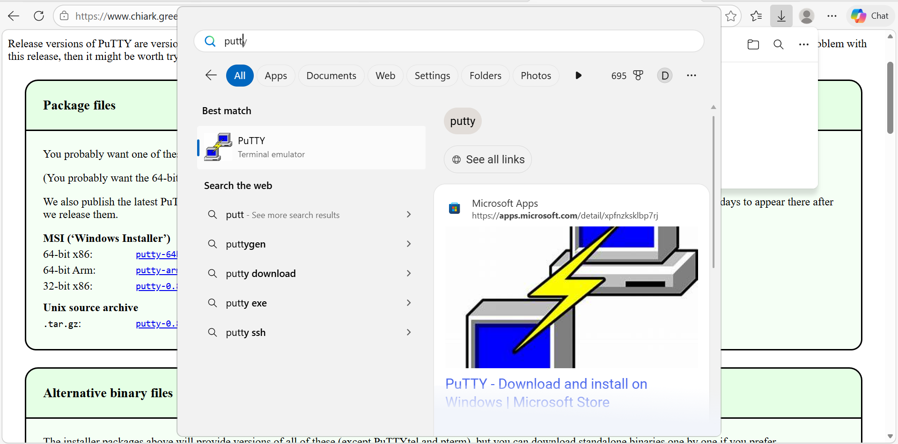
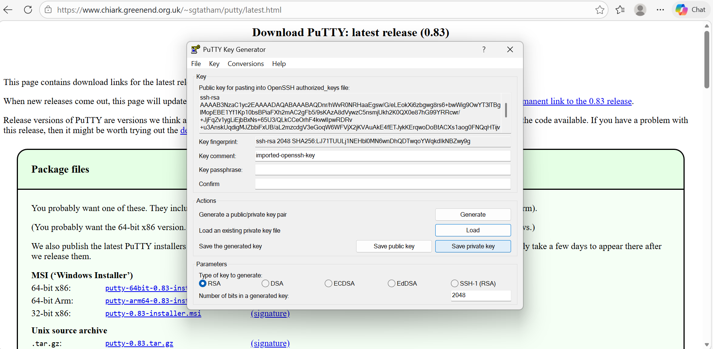
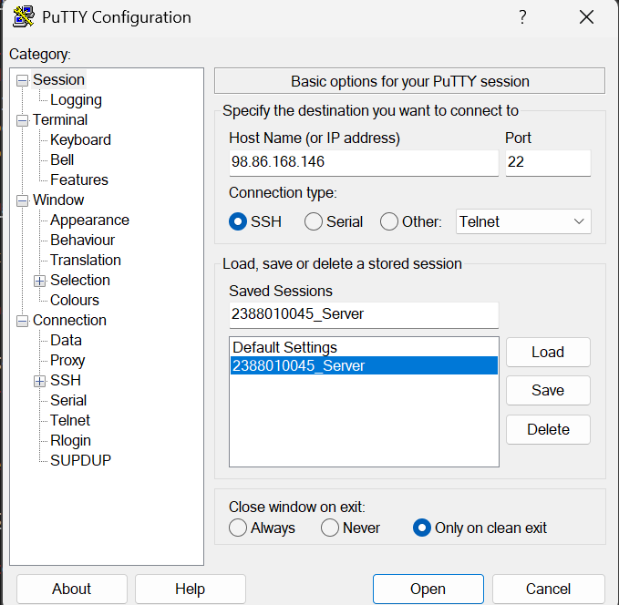
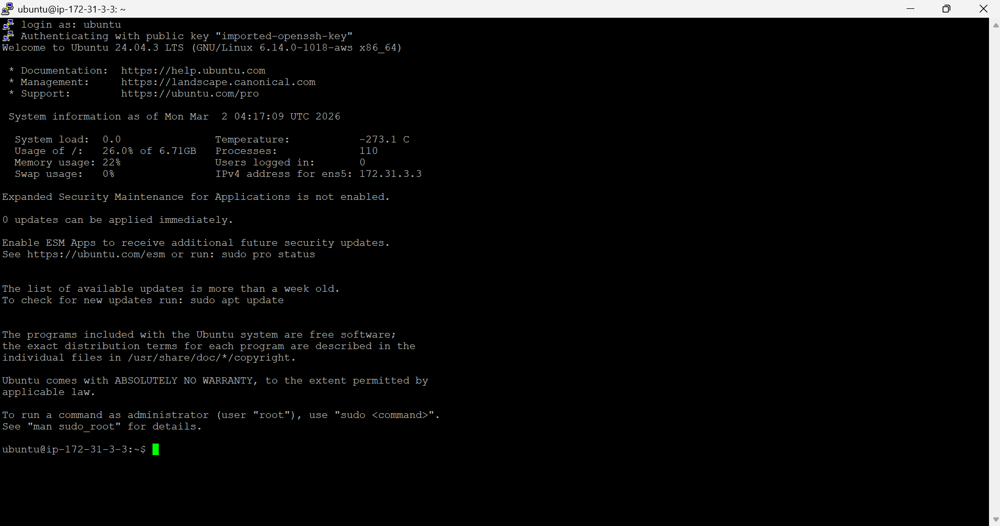
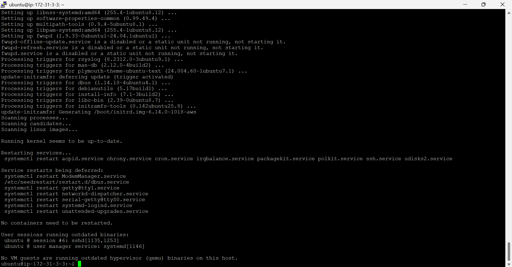
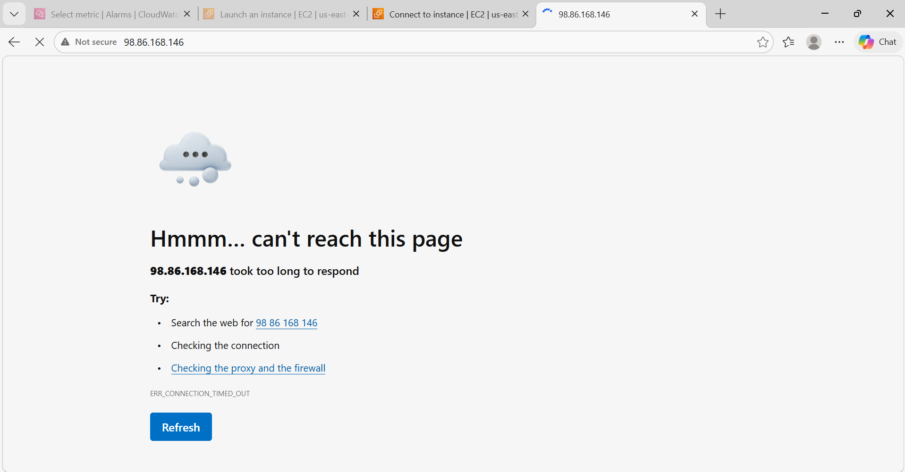
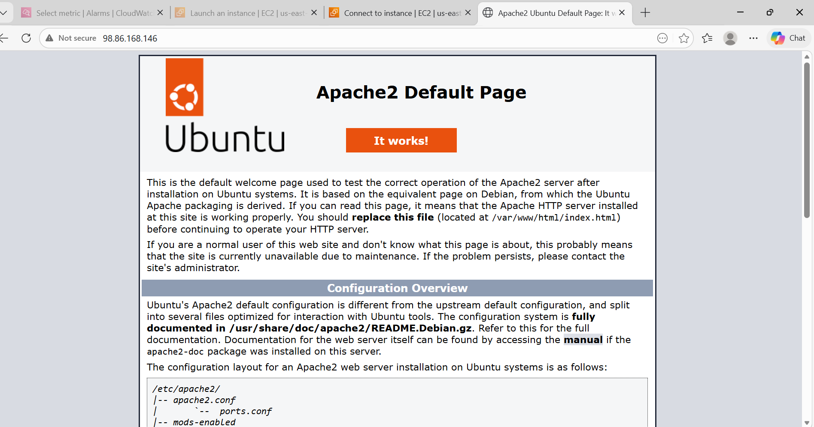
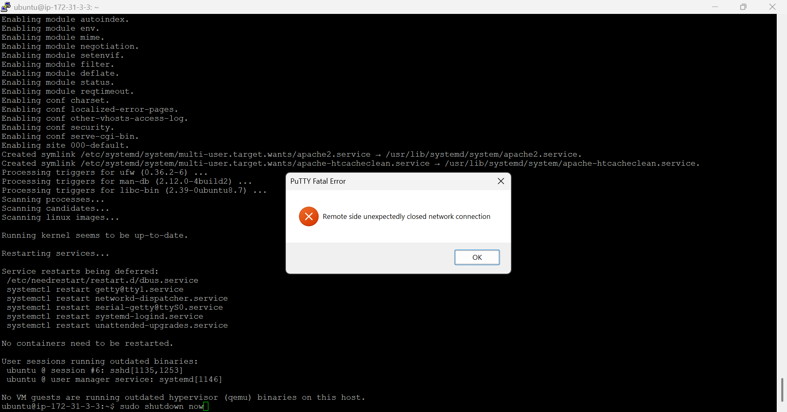
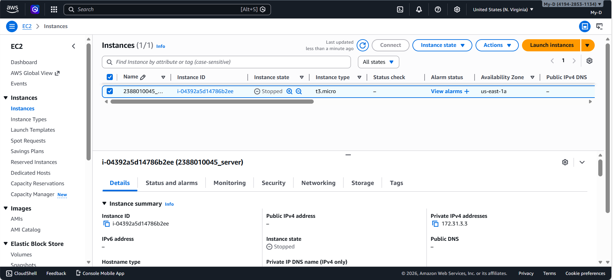

# Remote Instance with SSH Putty

1. Pastikan sudah Install Putty

2. Konversi File public key dari .pem ke .ppk di putty
    - buka puttygen di windows
    - cari file .pem yang didownload buka all file dulu agar ketemu
    - load file key.pem lalu ubah menjadi .ppk 
    - save file ke.ppk

3. Set up putty untuk remote SSH
- buka apps putty 
- Isi iP public sesuai instance
- isi port untuk SSH sesuai security Group di instance
- isi nama session agar saat connect lagi tinggal load saja
- load file .ppk  (klik SSH -> Klik Auth -> klik Credential -> Load data )
- kembali ke sessions klik save

- klik open
- masukan username sesuai instance

4. sudo apt-get update (update os) lanjut "sudo apt-get upgrade"

5. pembuktian remote SSH secara Visual
- copy public IP instance paste ke browser

- Install web server seperti apache/Nginx 
- sudo apt install apache2
- reload web browser

6. matikan Instance agar tidak kena tagihan 
 - sudo shutdown 

 
