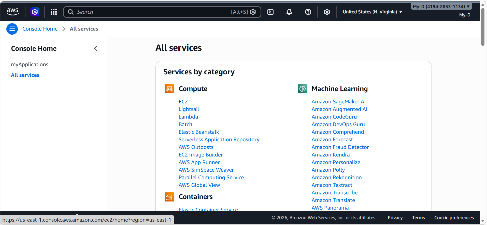
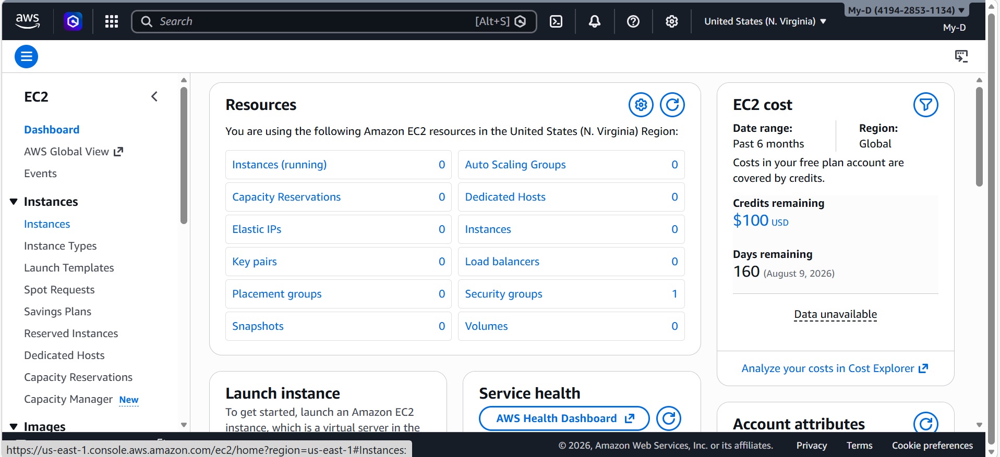
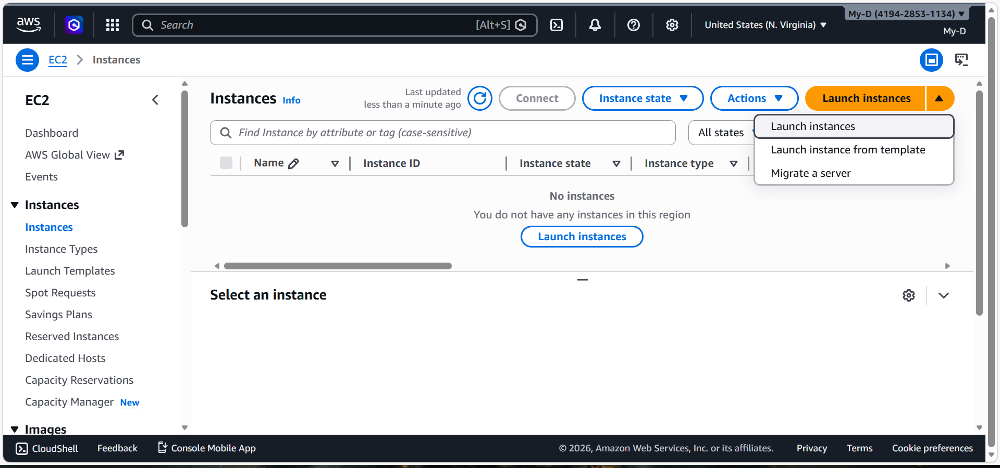
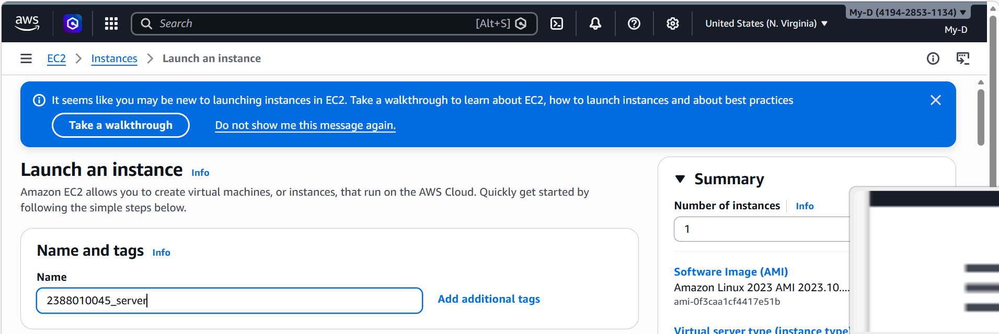
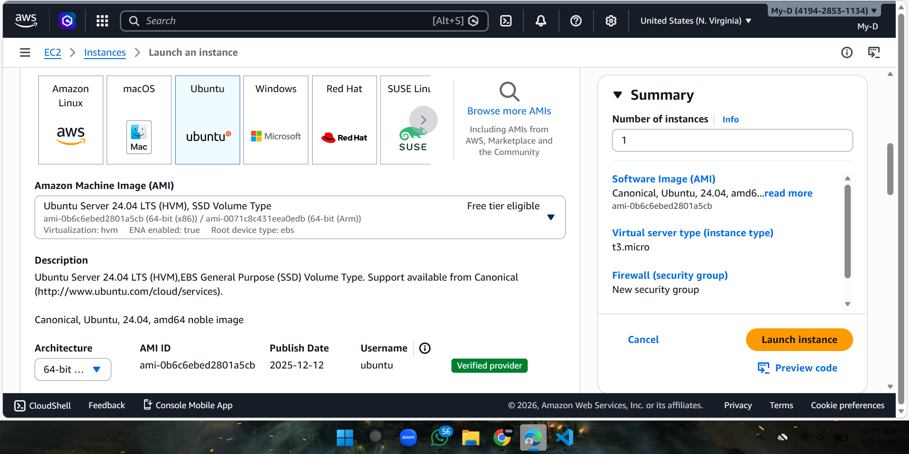
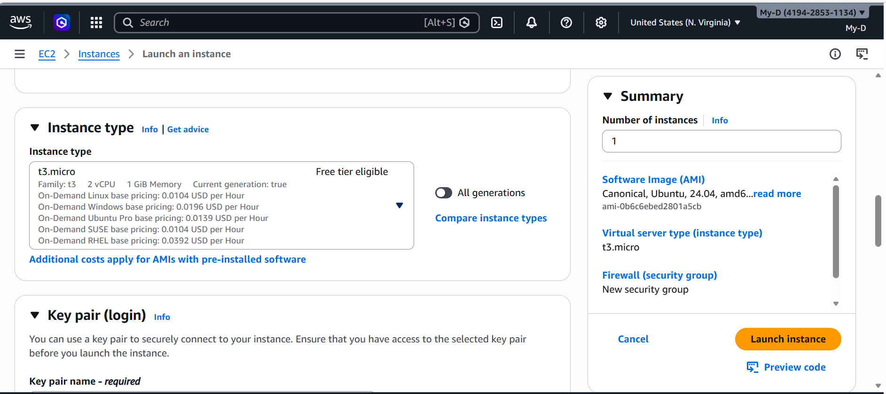
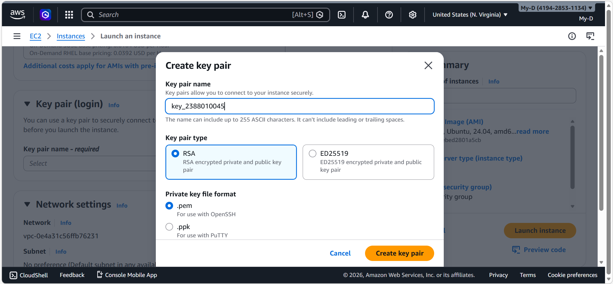
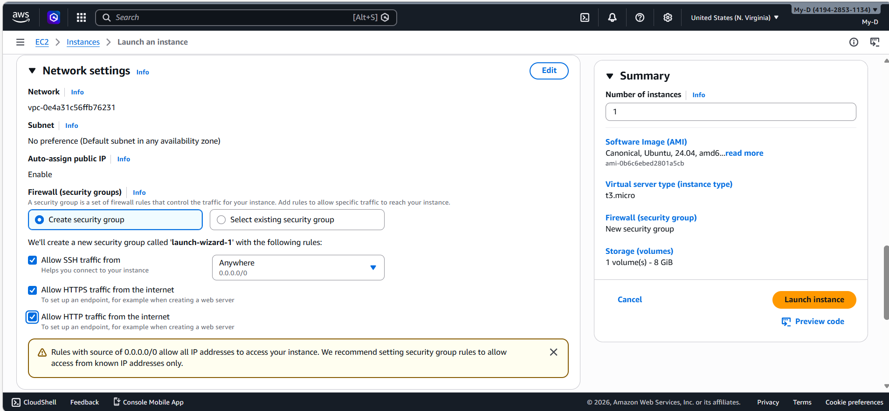
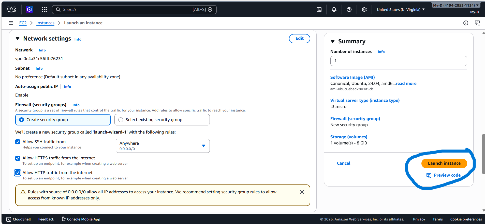
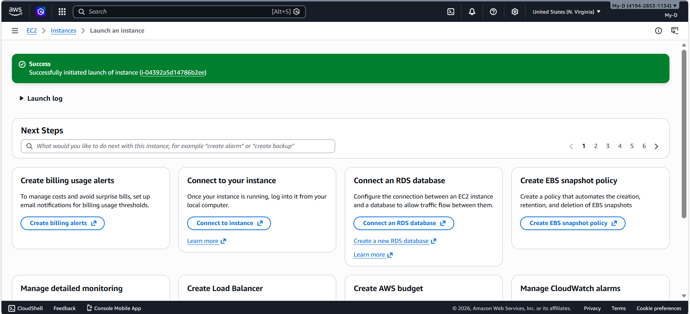

# Membuat EC2 / Instance / VM

1. Pilih Menu All services kemudian pilih EC2

2. didalam EC2 kita pilih instance

3. dalam menu instance pilih menu launch instance

4. Beri nama instance dengan Format NIM_server

5. Pilih OS server untuk Instance kita

6. Pilih resource instance T3.Micro (2VCPU, 1GB Memory)

7. Membuat Key Pair, pilih create new key pair, isi nama key, pilih RSA, format file .pem, create key pair

8. Setting kebijakan kemananan / security group
    -Allow SSH -> Artinya membolehkan remote dai luar
    -Allow HHTPS -> Artinya instance bisa di akses dari protokol HTTPS
    -Allow HHTP -> Artinya instance bisa di akses dari protokol HTTP

9. Setelah selesai set up pilih launc instance

10. Pastikan Launch Instance Sukses

