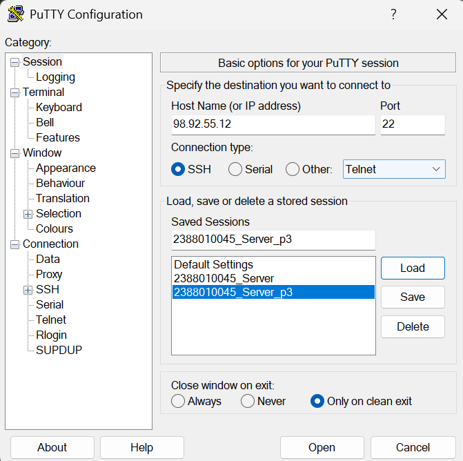
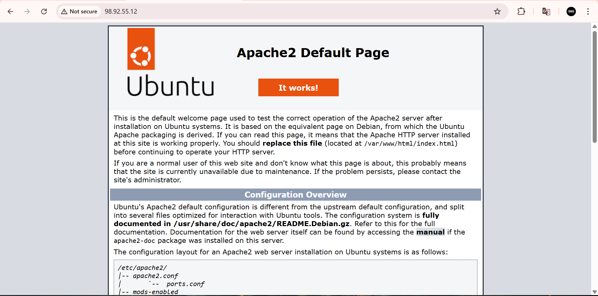
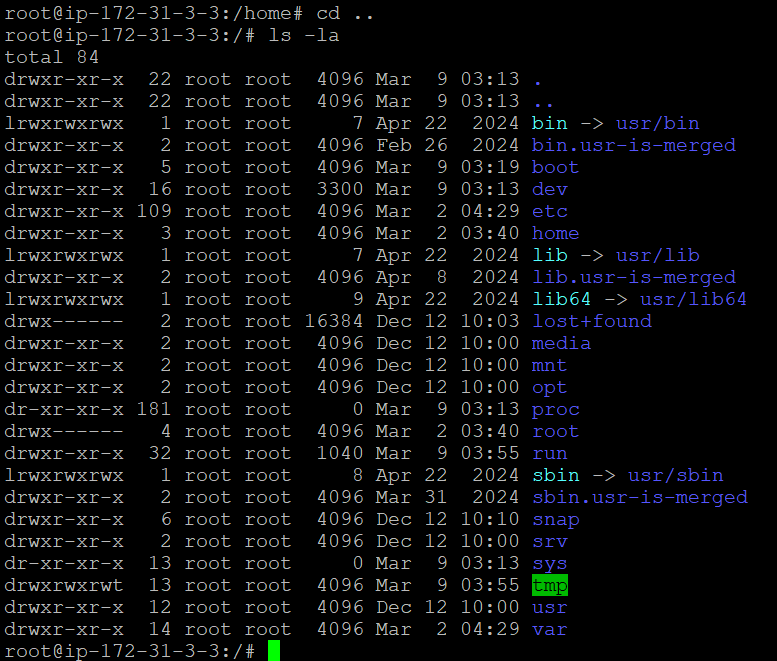
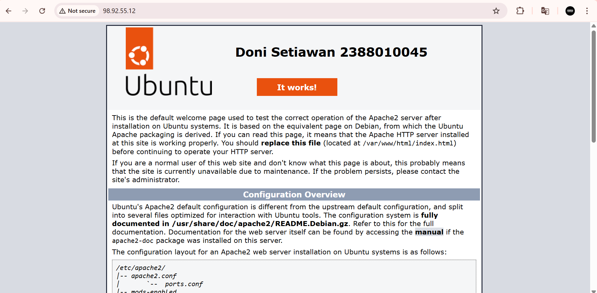

# Implementasi beberapa command line Interface Linux Ubuntu

1. Start Instance 
2. Buka putty
3. load save session yg disimpan pad pertemuan 2 
4. update bagian IpAdress v4

5. sudo apt get update (untuk Paching OS Linux Server)
6. cek web server kita (systemctl status apache2)
7. kalau web masih "cant be reached" hentikan dlu stop (sudo systemctl stop apache2)
8. lalu mulai lagi (sudo systemctl start apache2) reload lagi webnya

9. masukan command (ls - la) untuk melihat directory 
10. masukan sudo su (untuk masukan ke home)
11. masukan cd ../.. untuk masuk ke root folder lalu ketik ls -la 

12. masuk ke folder var (cd var/www/html)
13. nano index.html untuk custom Nama dan NIM  

