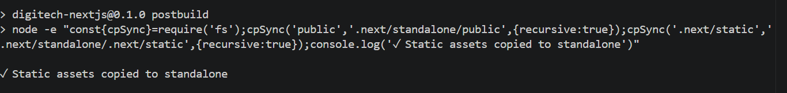
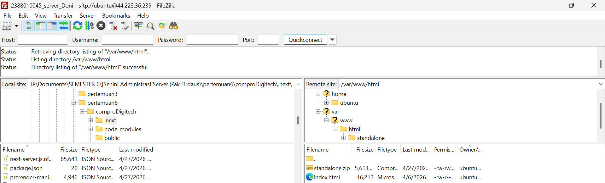
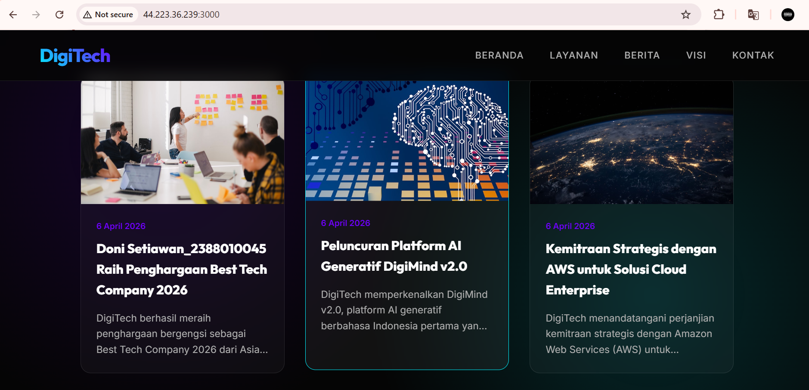

# melakukan Uploading web Apps Dynamic ke EC2 AWS

1. Pastikan Web Apps Dynamic sudah berjalan tanpa error di localhost
2. Jika sudah tanpa error kita akan membuat folder build 
    - npm run build
    - pastikan menghasilkan folder .next/standalone didalam tersedia folder public dan di folder .next ada folder static
    

3. Proses Upload File Folder Standalone
    - Lakukan proses archive pada folder .next/standalone dan folder public
    - Running Instance -> Connect open SSH -> Connect Filezilla
    - upload file hasil archive ke EC2 AWS menggunakan FIlezilla
    
    - Extract file hasil archive di EC2 AWS
        1. Install tools Unzip di EC2 AWS
            - sudo apt install unzip -y
        2. Ekstract file hasil Archive
            - unzip nama_file.zip

4. Export dbcompro dari localhost import ke EC2 AWS
    - login ke SQL ec2 sudo mysql -u USERCOMPRO -p
    - use dbCompro;
    - copy paste query SQL dari export dbCompro di localhost
    - cek setiap tabel apakah sudah terisi
        - select * from berita;
        - select * from users;

5. sesuaikan isi file .env di ec2 AWS
    - DB_HOST=localhost
    - DB_USER=USERCOMPRO
    - DB_PASSWORD=passwordCompro
    - DB_NAME=dbCompro
    - ctrl s

6. di terminal ssh cd ke folder standalone run apps -pm2 start server.js -pm2 save -pm2 startup

7. Buka port 3000 di security group ec2 aws 
    - edit security group
    - add rule
    - save 

    -cek perubahan 
    